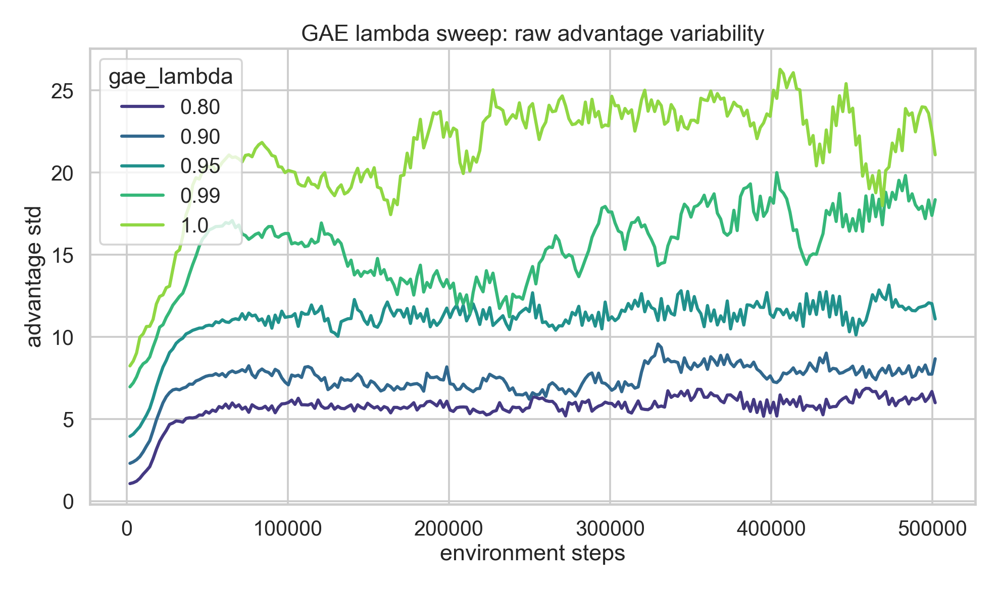
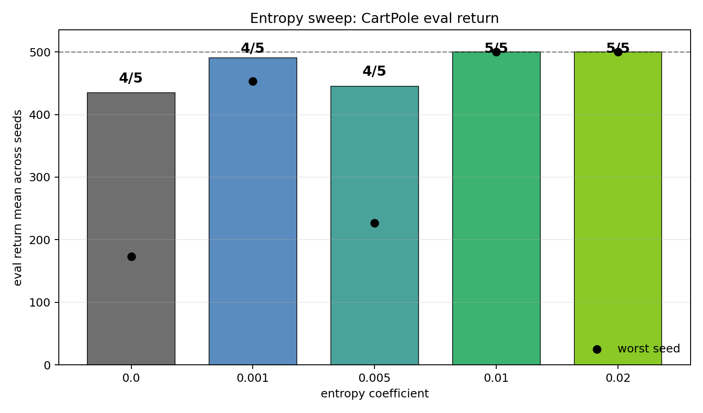
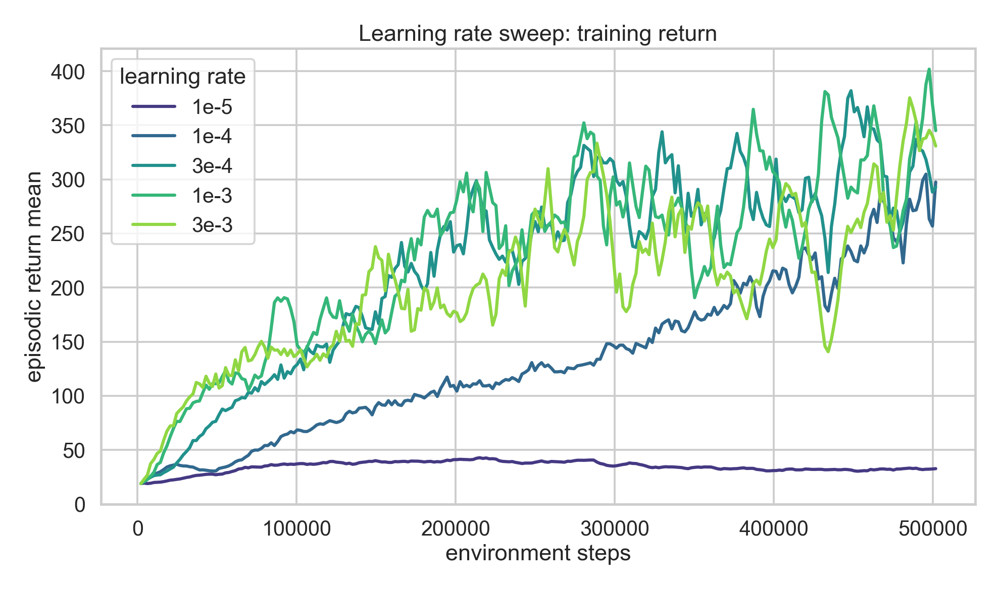
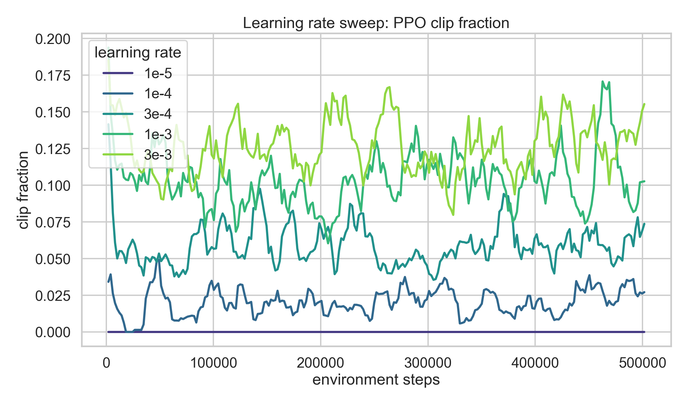
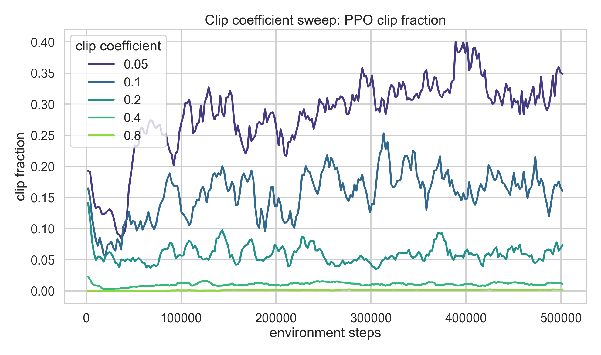
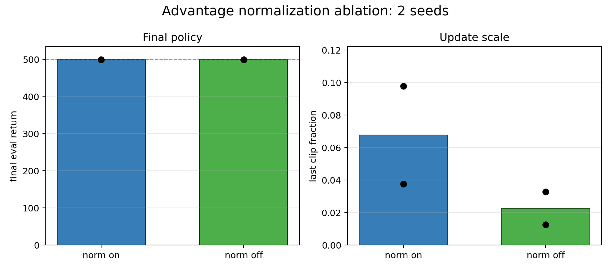

# Project 2 Report: PPO

This project implements PPO for small Gymnasium control tasks and uses CartPole
ablations to check the main PPO/GAE intuitions: advantage variance, entropy
regularization, learning-rate stability, clipping behavior, and advantage
normalization.

## Implementation Summary

- Discrete-action PPO with a shared actor-critic MLP.
- Vectorized rollout collection with stored observations, actions, log-probs,
  rewards, dones, and value predictions.
- Generalized advantage estimation, advantage normalization, PPO clipped policy
  loss, value loss, entropy bonus, approximate KL, clip fraction, gradient
  clipping, minibatch updates, and optional target-KL early stopping.
- Shared local and Modal training entrypoint, W&B logging, JSONL metrics,
  checkpoint save/load, and deterministic evaluation.
- Tests cover PPO math, rollout shapes, config overrides, logging artifacts,
  checkpoint/eval behavior, training infrastructure, and CPU smoke runs.

## PPO and GAE Derivation

The policy head represents `pi_theta(a_t | s_t)`, the value head represents
`V_phi(s_t)`, and rollouts are stored with tensors shaped `[time, env, ...]`.
For a rollout step `t`, PPO uses:

- `rewards[t] = r_t`
- `dones[t] = 1` if the transition ended the episode, otherwise `0`
- `values[t] = V_phi_old(s_t)`
- `logprobs[t] = log pi_theta_old(a_t | s_t)`
- `next_value = V_phi_old(s_T)` for bootstrapping after the final rollout step

### Policy Gradient Objective

The discounted return from time `t` is

$$
G_t = \sum_{l=0}^{\infty} \gamma^l r_{t+l}.
$$

The vanilla policy gradient maximizes expected return:

$$
J(\theta) = \mathbb{E}_{\tau \sim \pi_\theta}[G_0].
$$

Using the likelihood-ratio trick,

$$
\nabla_\theta J(\theta)
  = \mathbb{E}_t[\nabla_\theta \log \pi_\theta(a_t \mid s_t) G_t].
$$

Subtracting an action-independent baseline leaves the expected gradient
unchanged and reduces variance. With the value function as baseline,

$$
A_t = G_t - V_\phi(s_t)
$$

$$
\nabla_\theta J(\theta)
  = \mathbb{E}_t[\nabla_\theta \log \pi_\theta(a_t \mid s_t) A_t].
$$

PPO collects data under an old policy and reuses it for several minibatch
epochs. Importance sampling corrects for evaluating the new policy on old-policy
samples:

$$
r_t(\theta)
  = \frac{\pi_\theta(a_t \mid s_t)}
         {\pi_{\theta_{\mathrm{old}}}(a_t \mid s_t)}
  = \exp(
      \log \pi_\theta(a_t \mid s_t)
      - \log \pi_{\theta_{\mathrm{old}}}(a_t \mid s_t)
    ).
$$

The unclipped surrogate objective is

$$
L^{PG}(\theta) = \mathbb{E}_t[r_t(\theta) A_t].
$$

### Generalized Advantage Estimation

GAE starts from the one-step temporal-difference residual:

$$
\delta_t
  = r_t
    + \gamma (1 - done_t) V_{\phi_{\mathrm{old}}}(s_{t+1})
    - V_{\phi_{\mathrm{old}}}(s_t).
$$

The `(1 - done_t)` mask prevents bootstrapping across episode boundaries. GAE
introduces `lambda` to exponentially downweight later TD residuals:

$$
A_t^{GAE(\gamma, \lambda)}
  = \sum_{l=0}^{\infty} (\gamma \lambda)^l \delta_{t+l}.
$$

For a finite rollout of length `T`, the implementation computes the same value
with a reverse recurrence:

$$
\mathrm{gae}_T = 0
$$

$$
\mathrm{gae}_t
  = \delta_t
    + \gamma \lambda (1 - done_t) \mathrm{gae}_{t+1}
$$

$$
A_t = \mathrm{gae}_t,
\qquad
R_t = A_t + V_{\phi_{\mathrm{old}}}(s_t).
$$

`R_t` is the bootstrapped return target for the value function. The `lambda`
parameter controls the bias-variance tradeoff:

- `lambda = 0` uses the one-step TD residual, which is lower variance and more
  biased toward the current value function.
- `lambda = 1` approaches a Monte Carlo-style return, using longer-horizon
  information with higher variance.
- The baseline config uses `gamma = 0.99` and `gae_lambda = 0.95`.

Before optimization, the default update normalizes advantages over the flattened
rollout:

$$
\hat{A}_t = \frac{A_t - \mathrm{mean}(A)}
                  {\mathrm{std}(A) + 10^{-8}}.
$$

This keeps the policy loss scale more stable across rollouts and reward scales.

### PPO Clipped Policy Loss

With clipping parameter `epsilon = clip_coef`, define:

$$
\mathrm{clip}(r_t(\theta), 1 - \epsilon, 1 + \epsilon).
$$

The clipped surrogate objective is

$$
L^{CLIP}(\theta)
  = \mathbb{E}_t[
      \min(
        r_t(\theta) \hat{A}_t,
        \mathrm{clip}(r_t(\theta), 1 - \epsilon, 1 + \epsilon) \hat{A}_t
      )
    ].
$$

The implementation minimizes the negative objective:

$$
\mathrm{policy\_loss}
  = -\mathrm{mean}(
      \min(
        r_t \hat{A}_t,
        \mathrm{clip}(r_t, 1 - \epsilon, 1 + \epsilon) \hat{A}_t
      )
    ).
$$

The `min` has different effects depending on the sign of the advantage:

- If `A_hat_t > 0`, increasing the probability of `a_t` helps, but only up to
  `r_t = 1 + epsilon`.
- If `A_hat_t < 0`, decreasing the probability of `a_t` helps, but only down to
  `r_t = 1 - epsilon`.

This creates a conservative update without requiring an explicit constrained
optimization step.

### Value, Entropy, and Diagnostics

The value head is trained against the GAE return target:

$$
\mathrm{value\_loss}
  = \frac{1}{2}\mathrm{mean}((V_\phi(s_t) - R_t)^2).
$$

Entropy encourages exploration:

$$
\mathrm{entropy} = \mathbb{E}_t[H(\pi_\theta(\cdot \mid s_t))].
$$

The full loss minimized by `ppo_loss` is:

$$
\mathrm{loss}
  = \mathrm{policy\_loss}
    + \mathrm{vf\_coef} \cdot \mathrm{value\_loss}
    - \mathrm{ent\_coef} \cdot \mathrm{entropy}.
$$

The KL diagnostic uses the sampled-action approximation:

$$
\mathrm{log\_ratio}
  = \log \pi_\theta(a_t \mid s_t)
    - \log \pi_{\theta_{\mathrm{old}}}(a_t \mid s_t)
$$

$$
r_t = \exp(\mathrm{log\_ratio})
$$

$$
\mathrm{approx\_kl}
  = \mathrm{mean}((r_t - 1) - \mathrm{log\_ratio}).
$$

The clip fraction diagnostic is:

$$
\mathrm{clip\_fraction}
  = \mathrm{mean}(\mathbf{1}[|r_t - 1| > \epsilon]).
$$

High clip fraction means many samples are being capped by the PPO surrogate,
which can indicate that the optimizer step size, clipping range, or number of
update epochs is too aggressive for the collected rollout.

## Baseline

Environment: `CartPole-v1`

Baseline setup:

- `500k` environment steps, `8` vector envs, rollout length `256`
- PPO update: `4` epochs, minibatch size `128`, `clip_coef=0.2`
- Discounting/GAE: `gamma=0.99`, `gae_lambda=0.95`
- Regularization: `ent_coef=0.01`, `vf_coef=0.5`, `target_kl=0.03`
- Evaluation: `20` deterministic episodes

The controlled baseline solved CartPole in `5/5` seeds with final eval return
`500.0 +/- 0.0`.

## Ablation Results

### GAE Lambda

Question: does `gae_lambda` show the expected bias-variance tradeoff?

Sweep: `0.80`, `0.90`, `0.95`, `0.99`, `1.0` with seed `0`.

Takeaways:

- The variance side of the theory is visible: lower lambda keeps raw advantage
  estimates lower variance, while `0.99` and `1.0` produce much noisier
  advantages.
- Over the last 20 PPO updates, mean `advantage_std` increased from about
  `6.10` at `gae_lambda=0.80` to about `21.97` at `gae_lambda=1.0`.
- This sweep does not directly measure bias because there is no ground-truth
  advantage target. It supports the variance half of the GAE story.

| `gae_lambda` | Final eval return | Result |
|---:|---:|---|
| 0.80 | 500.0 | solved |
| 0.90 | 163.45 | final checkpoint regressed |
| 0.95 | 500.0 | solved |
| 0.99 | 500.0 | solved |
| 1.0 | 500.0 | solved |

### Entropy Coefficient

Question: does entropy regularization help prevent brittle exploration or policy
collapse?

Sweep: `0.0`, `0.001`, `0.005`, `0.01`, `0.02` across seeds `0-4`.

Takeaways:

- `ent_coef=0.01` and `0.02` solved all `5/5` seeds.
- Lower entropy values each had one weak seed, so the controlled sweep supports
  keeping nonzero entropy pressure for CartPole.
- Reruns of earlier weak baseline seeds solved under the controlled
  `ent_coef=0.01` setup, so the older `3/5` result is superseded.

| `ent_coef` | Mean eval return | Worst seed | Solve rate |
|---:|---:|---:|---:|
| 0.0 | 434.65 | 173.25 | 4/5 |
| 0.001 | 490.64 | 453.20 | 4/5 |
| 0.005 | 445.36 | 226.80 | 4/5 |
| 0.01 | 500.00 | 500.00 | 5/5 |
| 0.02 | 500.00 | 500.00 | 5/5 |

### Learning Rate

Question: does optimizer step size show the expected slow-learning vs
unstable-update tradeoff?

Sweep: `1e-5`, `1e-4`, `3e-4`, `1e-3`, `3e-3` with seed `0`.

Takeaways:

- `1e-5` was too small: training return stayed near random-play levels, with
  best train return only about `52`.
- `1e-4` solved, but learned more slowly than the baseline/aggressive settings.
- `3e-4` and `1e-3` both solved on this seed.
- `3e-3` reached return `500` during training but final deterministic eval
  collapsed to `128.15`; its clip fraction was the highest in the sweep.

| `optim.lr` | Final eval return | Best train return | Last clip fraction | Result |
|---:|---:|---:|---:|---|
| 1e-5 | 255.10 | 52.05 | 0.000 | too slow |
| 1e-4 | 500.00 | 483.60 | 0.015 | solved, slower |
| 3e-4 | 500.00 | 500.00 | 0.098 | solved baseline |
| 1e-3 | 500.00 | 500.00 | 0.072 | solved |
| 3e-3 | 128.15 | 500.00 | 0.208 | unstable final policy |

### PPO Clip Coefficient

Question: how much does PPO's clipping range constrain policy updates?

Sweep: `ppo.clip_coef=0.05,0.1,0.2,0.4,0.8` with seed `0`.

Takeaways:

- The clip-fraction diagnostic matches PPO theory: tight clipping (`0.05`,
  `0.1`) binds many updates, while loose clipping (`0.4`, `0.8`) barely clips.
- Approximate KL increases as the clipping range loosens, which means larger
  policy movement per update.
- This single seed did not produce a clean loose-clip eval failure: `0.4` and
  `0.8` both solved final deterministic eval, though `0.8` ended with weak
  sampled training return.

| `clip_coef` | Final eval return | Best train return | Last train return | Last clip fraction |
|---:|---:|---:|---:|---:|
| 0.05 | 500.00 | 365.80 | 159.18 | 0.304 |
| 0.10 | 246.80 | 500.00 | 367.71 | 0.113 |
| 0.20 | 500.00 | 500.00 | 283.67 | 0.098 |
| 0.40 | 500.00 | 500.00 | 221.44 | 0.012 |
| 0.80 | 500.00 | 500.00 | 67.00 | 0.001 |

### Advantage Normalization

Question: does normalizing advantages stabilize PPO updates enough to matter on
CartPole?

Sweep: `ppo.normalize_advantages=true/false` across seeds `0-1`.

Takeaways:

- Both normalized and unnormalized PPO solved final deterministic eval on both
  seeds.
- This did not produce a CartPole failure case; no-normalization was stable
  under the current baseline.
- The main difference is update scaling: without normalization, raw advantage
  magnitude directly scales the policy loss, but KL and clip fraction were not
  worse in this small 2-seed check.
- Advantage normalization remains a good default for scale robustness across
  tasks and reward scales, but CartPole does not strongly demonstrate the need
  for it here.

| Condition | Final eval returns | Last train returns | Last clip fraction |
|---|---|---|---|
| normalize on | 500.0, 500.0 | 283.67, 189.81 | 0.098, 0.038 |
| normalize off | 500.0, 500.0 | 415.50, 500.00 | 0.033, 0.013 |

## Generalization Check

Before running more CartPole ablations, the same PPO stack was tested on harder
discrete-control environments with configs adapted from RL Baselines3 Zoo.

Acrobot-v1, `500k` steps, 3 seeds:

- One seed improved clearly, with eval around `-161`.
- Two seeds ended at the timeout floor, `-500`.
- The stack can learn Acrobot-like behavior, but this config is not robust.

LunarLander-v3, `500k` steps, 3 seeds:

- All seeds improved from initial training returns.
- Final deterministic eval clustered around `-136` to `-138`, not solved.
- PPO is mechanically working beyond CartPole, but LunarLander needs a longer
  tuned run before it becomes a success claim.

## Conclusion

- PPO is implemented end to end and solves CartPole reliably under the
  controlled baseline.
- The ablations match the main PPO intuitions: GAE lambda controls advantage
  variance, entropy improves seed robustness, learning rate controls
  slow-learning vs instability, and clip coefficient controls how often PPO's
  update bound is active.
- Some runs reached return `500` during training and later regressed under final
  checkpoint evaluation. The final policy is useful, but training curves and
  best checkpoints give a more complete picture of PPO behavior.
- Advantage normalization did not produce a CartPole failure case, but it remains
  a sensible default because it stabilizes policy-loss scale across reward
  magnitudes and environments.

## Future Work

- Tune PPO more carefully on more complex environments such as Acrobot and
  LunarLander, where the current quick configs improve but do not reliably solve.
- Extend the PPO framework to continuous action spaces, replacing the discrete
  categorical policy head with a continuous distribution such as a Gaussian
  policy.
